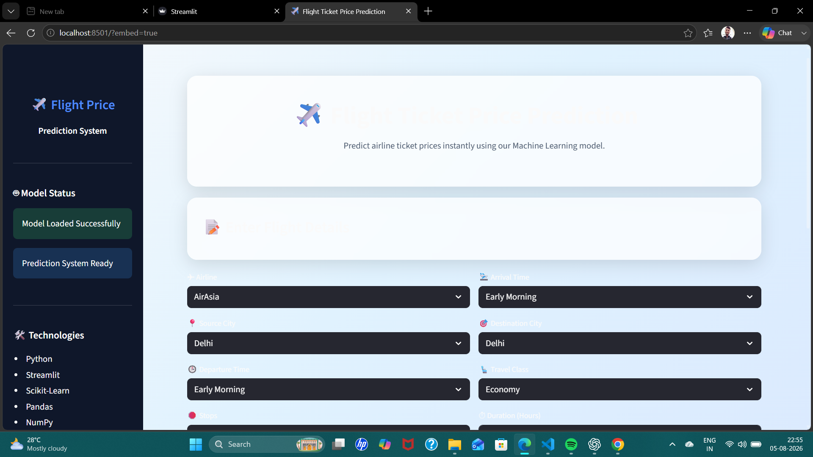
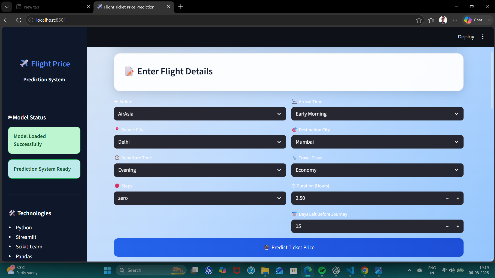
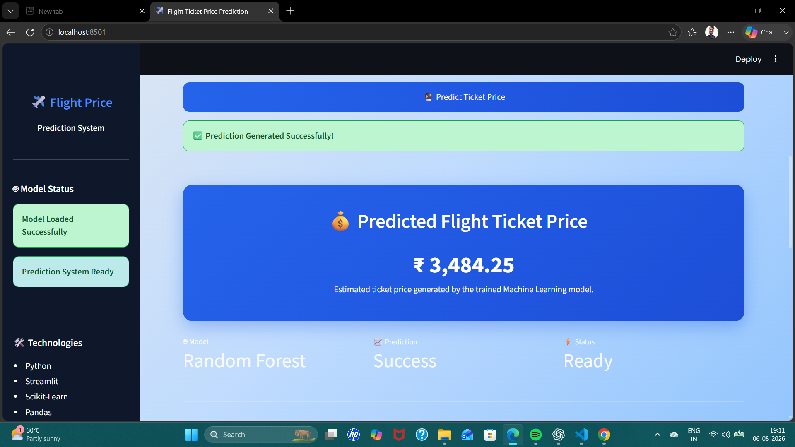
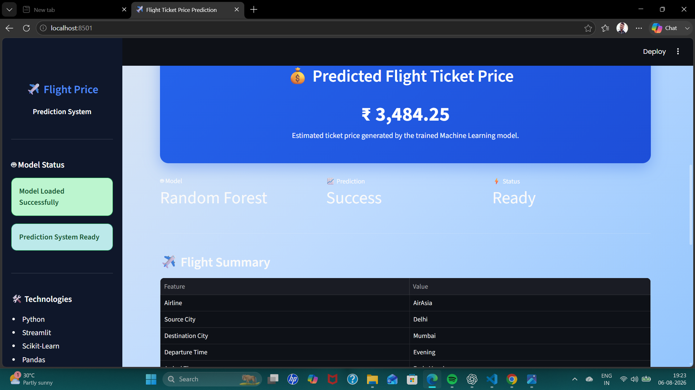

# ✈️ Flight Ticket Price Prediction System

<p align="center">


</p>

---

# 📌 Project Overview

The **Flight Ticket Price Prediction System** is an end-to-end Machine Learning application that predicts airline ticket prices based on various flight-related features.

The project covers the complete Machine Learning lifecycle starting from raw dataset preprocessing, exploratory data analysis (EDA), feature engineering, model building, hyperparameter tuning, model evaluation, deployment, and finally a production-ready Streamlit web application.

This project was developed to simulate a real-world machine learning workflow followed in the data science industry.

---

# 🎯 Project Objectives

The primary objective of this project is to develop a complete end-to-end Machine Learning system capable of predicting airline ticket prices accurately based on flight-related information.

This project was designed to simulate an industry-level Machine Learning workflow by covering every stage of the ML lifecycle, from data collection to deployment.

## The project aims to:

- Build a real-world regression-based Machine Learning application.
- Understand and analyze airline ticket pricing patterns.
- Perform comprehensive Exploratory Data Analysis (EDA).
- Clean and preprocess raw airline datasets.
- Handle missing values and categorical features efficiently.
- Perform feature engineering to improve model performance.
- Train and compare multiple Machine Learning regression algorithms.
- Optimize model performance using Hyperparameter Tuning.
- Select the best-performing model based on evaluation metrics.
- Save the trained model and preprocessing pipeline for deployment.
- Develop an interactive web application using Streamlit.
- Provide real-time flight ticket price predictions.
- Follow industry-standard project structure and coding practices.
- Create a portfolio-ready project for Data Science, Machine Learning, and AI roles.

---

## Expected Outcomes

After completing this project, users will be able to:

- Understand the complete Machine Learning project lifecycle.
- Learn how regression models are applied to real-world business problems.
- Deploy trained Machine Learning models into production.
- Build interactive web applications for Machine Learning.
- Gain practical experience with industry-standard tools and workflows.
- Showcase an end-to-end Machine Learning project in a professional portfolio.

---

# ✨ Key Features

The Flight Ticket Price Prediction System includes a complete end-to-end Machine Learning workflow with modern deployment capabilities.

## 📊 Data Processing

- Data collection from multiple airline datasets.
- Data cleaning and preprocessing.
- Missing value detection and handling.
- Duplicate record removal.
- Data type validation and conversion.
- Feature selection and feature engineering.
- Categorical feature encoding.
- Numerical feature scaling using preprocessing pipeline.

---

## 📈 Exploratory Data Analysis (EDA)

- Dataset overview and statistical summary.
- Distribution analysis of numerical features.
- Categorical feature analysis.
- Correlation analysis.
- Outlier detection.
- Feature relationship visualization.
- Price trend analysis.
- Business insights generation using visualizations.

---

## 🤖 Machine Learning

- Regression-based Machine Learning pipeline.
- Multiple regression models trained and evaluated.
- Hyperparameter tuning for model optimization.
- Model comparison using evaluation metrics.
- Best model selection.
- Model serialization using Joblib.
- Reusable preprocessing pipeline.

---

## 📊 Model Evaluation

The trained models were evaluated using industry-standard regression metrics:

- R² Score
- Mean Absolute Error (MAE)
- Mean Squared Error (MSE)
- Root Mean Squared Error (RMSE)
- Cross Validation Performance

---

## 🚀 Deployment

- Interactive Streamlit web application.
- Real-time ticket price prediction.
- User-friendly graphical interface.
- Model loading from serialized artifacts.
- Fast prediction pipeline.
- Production-ready application structure.

---

## 💻 Technologies Used

- Python
- Pandas
- NumPy
- Matplotlib
- Seaborn
- Scikit-Learn
- Joblib
- Streamlit

---

## 🎨 User Interface Features

- Modern responsive interface.
- Custom CSS styling.
- Interactive input forms.
- Dynamic prediction results.
- Professional dashboard layout.
- Sidebar navigation.
- Clean and minimal user experience.

---

## 📂 Project Deliverables

- Complete Data Analysis Notebook
- Data Preprocessing Pipeline
- Feature Engineering Pipeline
- Machine Learning Models
- Model Evaluation Report
- Trained Model Artifacts
- Streamlit Web Application
- GitHub Documentation

---

# 📂 Dataset Information

## 📌 Dataset Description

This project uses a real-world airline ticket pricing dataset containing information about domestic flight bookings. The dataset includes various flight-related attributes such as airline name, source city, destination city, departure time, arrival time, travel class, number of stops, flight duration, and ticket price.

The objective is to predict the **flight ticket price** using these features through supervised Machine Learning techniques.

---

## 🎯 Target Variable

The target variable used for prediction is:

| Variable | Description |
|----------|-------------|
| **Price** | Airline ticket price (Regression Target) |

---

## 📊 Input Features

The Machine Learning model is trained using the following features:

| Feature | Description |
|----------|-------------|
| Airline | Name of the airline |
| Source City | City from which the flight departs |
| Departure Time | Time category of departure |
| Stops | Number of stops during the journey |
| Arrival Time | Time category of arrival |
| Destination City | Destination of the flight |
| Travel Class | Economy or Business |
| Duration | Total flight duration (in hours) |

---

## 🧹 Data Preprocessing Performed

Before training the Machine Learning model, the following preprocessing steps were applied:

- Missing value handling
- Duplicate record removal
- Data type validation
- Feature selection
- Categorical feature encoding
- Numerical feature scaling
- Feature engineering
- Pipeline-based preprocessing
- Train-Test Split

---

## 📈 Dataset Characteristics

- Structured tabular dataset
- Combination of categorical and numerical features
- Supervised Learning dataset
- Regression problem
- Real-world airline pricing data

---

## 📁 Dataset Files

The project contains the following dataset files:

| File Name | Description |
|-----------|-------------|
| `Clean_Dataset.csv` | Cleaned dataset used for model training |
| `business.csv` | Business class flight records |
| `economy.csv` | Economy class flight records |

---

## 🎯 Problem Statement

Given the flight details provided by the user, the Machine Learning model predicts the expected airline ticket price.

This is a **Supervised Machine Learning Regression Problem**, where the goal is to estimate a continuous numerical value (ticket price) based on historical airline booking data.

---

# 🏗️ Project Architecture & Machine Learning Workflow

This project follows a complete end-to-end Machine Learning pipeline, covering every stage from raw data processing to model deployment.

---

## 📌 End-to-End Workflow

```text
                    Raw Dataset
                         │
                         ▼
              Data Understanding
                         │
                         ▼
          Exploratory Data Analysis (EDA)
                         │
                         ▼
          Data Cleaning & Preprocessing
                         │
                         ▼
             Feature Engineering
                         │
                         ▼
          Train-Test Split (80:20)
                         │
                         ▼
      Machine Learning Model Training
                         │
                         ▼
      Hyperparameter Tuning (GridSearchCV)
                         │
                         ▼
          Model Performance Comparison
                         │
                         ▼
          Best Model Selection
                         │
                         ▼
     Save Model & Preprocessor (Joblib)
                         │
                         ▼
      Streamlit Web Application
                         │
                         ▼
        Real-Time Price Prediction
```

---

# 📚 Project Workflow

## 1️⃣ Data Understanding

The project begins with understanding the dataset, identifying feature types, checking missing values, duplicates, and exploring the target variable.

---

## 2️⃣ Exploratory Data Analysis (EDA)

EDA was performed to discover useful patterns and relationships within the data.

The analysis included:

- Dataset overview
- Statistical summary
- Missing value analysis
- Duplicate analysis
- Distribution plots
- Correlation analysis
- Outlier detection
- Feature relationship analysis
- Business insights

---

## 3️⃣ Data Preprocessing

The dataset was cleaned and transformed before model training.

Preprocessing steps included:

- Missing value handling
- Duplicate removal
- Feature selection
- Data type correction
- Encoding categorical variables
- Feature scaling
- Building a preprocessing pipeline

---

## 4️⃣ Feature Engineering

Relevant features were prepared to improve model performance.

Examples include:

- Airline information
- Source city
- Destination city
- Departure time
- Arrival time
- Travel class
- Number of stops
- Flight duration

These features were transformed into a machine-learning-friendly format using Scikit-Learn pipelines.

---

## 5️⃣ Model Building

Multiple regression algorithms were trained and evaluated.

The models were compared using common regression metrics to identify the most suitable algorithm for flight price prediction.

---

## 6️⃣ Hyperparameter Tuning

The selected model was optimized using **GridSearchCV** to improve prediction accuracy.

The best hyperparameters were saved for future use.

---

## 7️⃣ Model Evaluation

The final model was evaluated on unseen test data using:

- R² Score
- Mean Absolute Error (MAE)
- Mean Squared Error (MSE)
- Root Mean Squared Error (RMSE)

These metrics helped measure the model's prediction performance and generalization capability.

---

## 8️⃣ Model Serialization

The trained model and preprocessing pipeline were saved using **Joblib**.

Saved artifacts include:

- `best_model.pkl`
- `preprocessor.pkl`
- `best_parameters.json`
- `model_comparison.csv`

These files allow the application to make predictions without retraining the model.

---

## 9️⃣ Deployment

The trained model was integrated into a **Streamlit Web Application**.

The application allows users to:

- Enter flight details
- Predict ticket prices instantly
- View results through an interactive user interface

---

## 🔄 Complete Machine Learning Pipeline

```text
Raw Dataset
      │
      ▼
Data Understanding
      │
      ▼
EDA
      │
      ▼
Data Cleaning
      │
      ▼
Feature Engineering
      │
      ▼
Preprocessing Pipeline
      │
      ▼
Train-Test Split
      │
      ▼
Model Training
      │
      ▼
Hyperparameter Tuning
      │
      ▼
Model Evaluation
      │
      ▼
Best Model Selection
      │
      ▼
Save Model
      │
      ▼
Streamlit Deployment
      │
      ▼
Real-Time Prediction
```

---

# 🚀 Installation & Usage Guide

Follow the steps below to run the project on your local machine.

---

# 📋 Prerequisites

Before running this project, make sure the following software is installed:

- Python 3.10 or above
- Git
- Visual Studio Code (Recommended)
- pip (Python Package Manager)

---

# 📥 Step 1: Clone the Repository

```bash
git clone https://github.com/your-username/Flight_Ticket_Price_Prediction.git
```

Move into the project directory:

```bash
cd Flight_Ticket_Price_Prediction
```

---

# 📦 Step 2: Install Dependencies

Install all required Python libraries:

```bash
pip install -r requirements.txt
```

---

# 📁 Step 3: Verify Project Structure

Make sure your project folder looks like this:

```text
Flight_Ticket_Price_Prediction/

│── app.py
│── README.md
│── requirements.txt
│── artifacts/
│     ├── best_model.pkl
│     ├── preprocessor.pkl
│     ├── best_parameters.json
│     └── model_comparison.csv
│
│── Dataset/
│     ├── Clean_Dataset.csv
│     ├── business.csv
│     └── economy.csv
│
└── notebooks/
```

---

# ▶️ Step 4: Run the Streamlit Application

Start the web application using:

```bash
streamlit run app.py
```

---

# 🌐 Step 5: Open the Application

Once the application starts successfully, Streamlit will automatically open in your browser.

If it doesn't open automatically, visit:

```text
http://localhost:8501
```

or

```text
http://127.0.0.1:8501
```

---

# 📝 How to Use

1. Select the airline.
2. Choose the source city.
3. Choose the destination city.
4. Select departure time.
5. Select arrival time.
6. Choose the number of stops.
7. Select travel class.
8. Enter flight duration.
9. Enter days left before departure.
10. Click **Predict Ticket Price**.

The application will instantly display the predicted airline ticket price.

---

# 📤 Output

The application displays:

- Predicted Flight Ticket Price
- Flight Details Summary
- Model Prediction Status
- Interactive Dashboard

---

# ⚠️ Troubleshooting

### If Streamlit is not installed:

```bash
pip install streamlit
```

---

### If dependencies are missing:

```bash
pip install -r requirements.txt
```

---

### If the browser doesn't open automatically:

Run the application and manually visit:

```text
http://localhost:8501
```

---

### If model files are missing:

Ensure the following files are present inside the `artifacts/` directory:

- `best_model.pkl`
- `preprocessor.pkl`

Without these files, the application will not be able to generate predictions.

---

# 🎉 You're Ready!

After completing the above steps, the Flight Ticket Price Prediction application is ready to use.

Simply enter the flight information and receive an instant ticket price prediction powered by Machine Learning.

---

# 📸 Project Screenshots

The following screenshots demonstrate different stages of the Flight Ticket Price Prediction application.

---

## 🏠 Home Page

The home page provides a clean and user-friendly interface where users can enter all required flight details.

**Features:**

- Modern UI
- Interactive Sidebar
- Flight Details Form
- Responsive Layout

> 📷 **Screenshot**



---

## 📝 Flight Details Form

Users can enter all flight-related information before making a prediction.

Input fields include:

- Airline
- Source City
- Destination City
- Departure Time
- Arrival Time
- Number of Stops
- Travel Class
- Flight Duration
- Days Left

> 📷 **Screenshot**



---

## 💰 Prediction Result

After clicking **Predict Ticket Price**, the application displays the estimated ticket price generated by the trained Machine Learning model.

The prediction dashboard includes:

- Predicted Price
- Flight Summary
- Model Status
- Prediction Confirmation

> 📷 **Screenshot**



---

## 📊 Prediction Dashboard

The dashboard summarizes the prediction in a professional format.

Displayed information includes:

- Predicted Ticket Price
- Selected Flight Details
- Model Information
- Prediction Status

> 📷 **Screenshot**



---

## 🎯 Key Highlights

✔️ End-to-End Machine Learning Project

✔️ Data Cleaning & Preprocessing

✔️ Exploratory Data Analysis (EDA)

✔️ Feature Engineering

✔️ Model Training

✔️ Hyperparameter Tuning

✔️ Model Evaluation

✔️ Model Serialization

✔️ Streamlit Deployment

✔️ Professional User Interface

✔️ Real-Time Ticket Price Prediction

---

> **Note:** Replace the placeholder images with actual screenshots stored inside the `images/` folder after uploading them to your GitHub repository.

---

# 📂 Project Structure

The project follows a clean and modular folder structure for better maintainability and scalability.

```text
Flight_Ticket_Price_Prediction/
│
├── app.py                              # Streamlit Application
├── README.md                           # Project Documentation
├── requirements.txt                    # Required Python Libraries
│
├── Dataset/
│   ├── business.csv
│   ├── economy.csv
│   └── Clean_Dataset.csv
│
├── artifacts/
│   ├── best_model.pkl                  # Trained Machine Learning Model
│   ├── best_parameters.pkl             # Best Hyperparameters
│   ├── model_comparison.csv            # Model Performance Comparison
│   └── preprocessor.pkl                # Data Preprocessing Pipeline
│
├── images/
│   ├── home_page.png
│   ├── input_form.png
│   ├── prediction_result.png
│   ├── Dashboard.png
│   └── about_section.png
│
├── outputs/
│   └── flight_price_predictions.csv
│
├── notebooks/
│   ├── 01_Data_Understanding.ipynb
│   ├── 02_Exploratory_Data_Analysis.ipynb
│   ├── 03_Data_Preprocessing_&_Feature_Engineering.ipynb
│   ├── 04_Model_Building_&_Model_Selection.ipynb
│   ├── 05_Model_Evaluation_&_Explainability.ipynb
│   └── 06_Inference_Pipeline_&_Deployment.ipynb
│
└── .vscode/
    ├── README.md
    └── settings.json
```

---

## 📁 Folder Description

### 📂 Dataset
Contains the raw and cleaned airline ticket datasets used for training and testing.

### 📂 Artifacts
Stores all trained machine learning files generated during model training.

- Trained Model (.pkl)
- Data Preprocessor
- Best Hyperparameters
- Model Comparison Report

### 📂 Images
Contains screenshots used inside the README documentation.

### 📂 Outputs
Stores prediction outputs exported from the Streamlit application.

### 📂 Notebooks
Contains the complete machine learning workflow.

- Data Understanding
- Exploratory Data Analysis
- Data Preprocessing
- Feature Engineering
- Model Building
- Model Evaluation
- Deployment

### 📂 .vscode
VS Code configuration files for the project.

---

# 👨‍💻 Author

## Nitin Maurya

**Aspiring Data Scientist | Machine Learning Engineer | AI Enthusiast**

I am passionate about Data Science, Machine Learning, Artificial Intelligence, and building real-world end-to-end projects.

This project demonstrates my ability to build a complete Machine Learning pipeline—from data preprocessing to model deployment using Streamlit.

---

# 🚀 Future Improvements

Some planned improvements for future versions include:

- ✈️ Live Flight API Integration
- 📈 Dynamic Ticket Price Tracking
- 🤖 Deep Learning-based Prediction Models
- ☁️ Cloud Deployment (AWS / Azure / GCP)
- 📊 Interactive Analytics Dashboard
- 📱 Mobile Responsive UI
- 🔔 Price Drop Alert System
- 🌍 Multi-Currency Support
- 💳 Booking Recommendation System
- 🧠 Explainable AI (SHAP & LIME)

---

# 📜 License

This project is created for educational and portfolio purposes.

You are free to use this project for learning and personal practice.

---

# 🙏 Acknowledgements

Special thanks to:

- Kaggle (Dataset Provider)
- Streamlit
- Scikit-Learn
- Pandas
- NumPy
- Matplotlib
- Seaborn
- Python Community

for providing amazing open-source tools and resources.

---

# ⭐ Support

If you found this project useful,

⭐ Star this repository

🍴 Fork this project

🛠️ Improve it

📢 Share it with others

Your support motivates me to build more Machine Learning and AI projects.

---

# 📬 Connect With Me

- GitHub: *(https://github.com/Nitn-Maurya-457)*
- LinkedIn: *(https://www.linkedin.com/in/nitin-maurya-4741113a3/)*
- Email: *(nitin08022008@gmail.com)*

---

# 🎉 Thank You

Thank you for visiting this repository.

Happy Learning!

Happy Coding! 🚀

